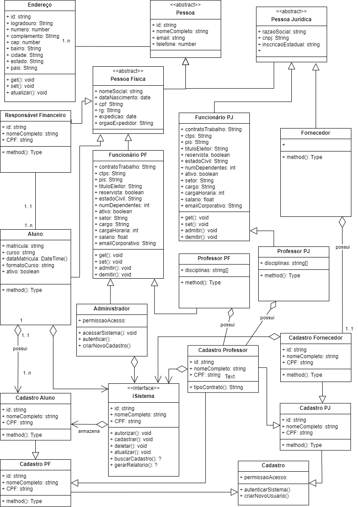
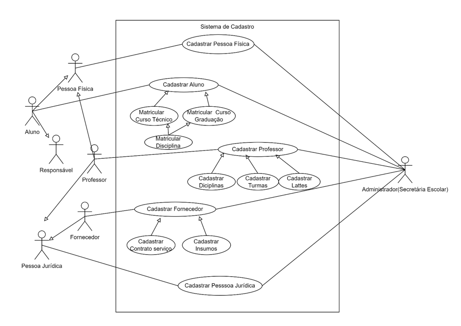

# Projeto Integrador - Desenvolvimento de Sistemas Orientado a Objetos
A proposta é criar um sistema de **gestão de dados** para o processo de cadastro de alunos, professores, funcionários e fornecedores, pessoas física e jurídica, de uma Universidade.

## Requisitos
- Cadastro de **_Pessoa Física_**
- Cadastro de **_Pessoa Jurídica_**
- Cadastro de **_Professores_**
- Cadastro de **_Fornecedores_**
- Cadastro de **_Alunos_**

## Prototipação

## Diagrama de Classes (UML)

## Diagrama de Casos de Uso (UML)

## Desenvolvimento
### Ferramentas
- Figma
- HTML
- CSS
- JavaScript
- Java